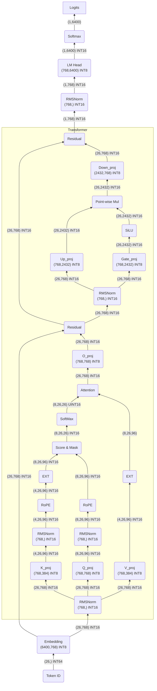

# minimind 模型架构


## 1 逐层分析

> 假设输入 batch 为 1，token 数量为 26。

### 1.1 Tokenizer Encode

- **输入**：字符串。

- **计算**：将输入字符串转换成 token。
- **输出**：每个 token 的 token ID， `(1, 26)`。

### 1.2 Input Embedding

- **输入**：token ID，`(1, 26)`。
- **权重**：Embedding 权重，`(6400, 768)`。
- **计算**：根据 token ID 查权重表。
- **输出**：隐藏状态，`(1, 26, 768)`。

### 1.3 RMSNorm

- **输入**：`(1, 26, 768)`。

- **权重**：缩放参数 $\gamma_i$，`(768)`。

- **计算**：对每一行 768 维向量计算均方根并缩放。

    > $\epsilon$ 用于防止除以零。

    $$
    \text{RMS}(x)=\sqrt{\frac{1}{768}\sum_{i=1}^{768}x_i^2+\epsilon}\\
    y_i=\frac{x_i}{\text{RMS}(x)}\cdot\gamma_i
    $$

- **输出**：`(1, 26, 768)`。

### 1.4 生成 Q、K、V

- **输入**：`(1, 26, 768)`。

- **权重**：$W_Q$ `(768, 768)`，$W_K$ `(768, 384)`，$W_V$ `(768, 384)`。

    > pytorch 中是转置的，如 `k_proj.weight: (384, 768)`。

- **计算**：

    - $Q=XW_Q$ `(1, 26, 768)`；$K=XW_K$ `(1, 26, 384)`；$V=XW_V$ `(1, 26, 384)`。
    - Q 拆成 8 个头，`(1, 26, 8, 96)`；K 和 V 拆成 4 个头，`(1, 26, 4, 96)`。
    - 交换 token 和 head 维，变成 `(1, 8, 26, 96)` 和 `(1, 4, 26, 96)`。

- **输出**：Q `(1, 8, 26, 96)`，K `(1, 4, 26, 96)`，V `(1, 4, 26, 96)`。

### 1.5 对 Q、K 做 RMSNorm

形状不变。

### 1.6 RoPE 位置编码

- **输入**：Q `(1, 8, 26, 96)`，K `(1, 4, 26, 96)`，V `(1, 4, 26, 96)`。
- **计算**：只对 Q 和 K 进行旋转，形状不改变。
- **输出**：Q `(1, 8, 26, 96)`，K `(1, 4, 26, 96)`，V `(1, 4, 26, 96)`。

### 1.7 扩展 K、V 头

- **输入**：Q `(1, 8, 26, 96)`，K `(1, 4, 26, 96)`，V `(1, 4, 26, 96)`。
- **计算**：当前 Q、K、V 头数不一样，让每一组 K、V 被两个 Q 头共享，即将 K、V 的 4 个头每个重复 2 次。
- **输出**：Q `(1, 8, 26, 96)`，K `(1, 8, 26, 96)`，V `(1, 8, 26, 96)`。

### 1.8 计算 Attention 权重

- **输入**：Q `(1, 8, 26, 96)`，K `(1, 8, 26, 96)`。

- **计算**：

    - 每个头取后 2 维做 $S=\frac{QK^T}{\sqrt{96}}$，然后合到一起得到 `(1, 8, 26, 26)`。结果的后 2 维表示第 i 个 token 与第 j 个 token 的匹配程度。

    - 加入掩码，一个 token 只能读取自己和前面的 token，被禁用的位置会加上负无穷。

        ```
        i\j  0    1    2    3
        0    ✓    ×    ×    ×
        1    ✓    ✓    ×    ×
        2    ✓    ✓    ✓    ×
        3    ✓    ✓    ✓    ✓
        ```

    - 对每一行进行 Softmax，$k$ 表示循环一行的所有 $j$。
        $$
        A_{i,j}=\frac{e^{S_{i,j}}}{\sum_k e^{S_{i,k}}}
        $$

- **输出**：注意力权重 A `(1, 8, 26, 26)`。

### 1.9 用注意力权重读取 V

> 这一步 Attention 的结果不再只是当前 token 自己的信息，而是融合了上下文。

- **输入**：注意力权重 A `(1, 8, 26, 26)`，V `(1, 8, 26, 96)`。
- **计算**：$O=AV$。对于每一个 token，设其注意力权重为 $[a_0,\cdots,a_{25}]$（A 的最后一维的每个数），而每一个 token 都有一个 $V_i$（V 的最后一维长度为 96 的向量），实际上就是一个内积 $O_i=\sum a_iV_i$。
- **输出**：O `(1, 8, 26, 96)`。

### 1.10 拼接多头并进行输出投影

- **输入**：O `(1, 8, 26, 96)`。
- **权重**：$W_O$ `(768, 768)`。
- **计算**：
    - 先交换维度得到 `(1, 26, 8, 96)`。
    - 然后合并最后两维得到 `(1, 26, 768)`。
    - 混合各个头：$Y=OW_O$。
- **输出**：`(1, 26, 768)`。

### 1.11 残差连接

- **输入**：原始输入 x `(1, 26, 768)`，Attention 输出 `(1, 26, 768)`。
- **计算**：逐元素相加，$h=x+\text{Attention}(x)$。
- **输出**：h `(1, 26, 768)`。

### 1.12 RMSNorm

同理，形状不变。

### 1.13 MLP 的扩维与门控

> 也叫 FFN，Feed-Forward Network。

- **输入**：z `(1, 26, 768)`。
- **权重**：$W_{gate}$ `(768, 2432)`，$W_{up}$ `(768, 2432)`。
- **计算**：gate 分支像一个可学习的开关，控制 up 分支中的信息通过多少。
    - 升维 $g=zW_{gate},u=zW_{up}$。
    - 对 gate 分支使用 SiLU，$\text{SiLU}(g)=g\cdot \sigma(g)$，$\sigma$ 是 Sigmoid（$\sigma(x)=\frac{1}{1+e^{-x}}$）。
    - 两个分支逐元素相乘，$m=\text{SiLU}{g}\odot u$。
- **输出**：m `(1, 26, 2432)`。

### 1.14 down_proj 压回 768 维

- **输入**：m `(1, 26, 2432)`。
- **权重**：$W_{down}$ `(2432, 768)`。
- **计算**：$o=mW_{down}$。
- **输出**：o `(1, 26, 768)`。

### 1.15 Dropout 和残差连接

- **输入**：o `(1, 26, 768)`，之前的 h `(1, 26, 768)`。
- **计算**：
    - Dropout 在推理中不使用。
    - $y=h+o$。
- **输出**：`(1, 26, 768)`。

### 1.16 Final RMSNorm

经过 8 个 Transformer Block 后，得到 hidden_states `(1, 26, 768)`。经过 RMSNorm 后形状不变。

### 1.17 LM Head 映射到词表

- **输入**：hidden_states `(1, 26, 768)`。
- **权重**：$W_{lm}$ `(6400, 768)`，MiniMind 设置了 tie_word_embeddings = True 所以这里的矩阵和 Embedding 共享权重。
- **计算**：LM Head 是一个线性层，把每个 token 的 768 维隐藏向量映射到词表大小 6400。$\text{logits}=XW_{lm}^T$。
- **输出**：`(1, 26, 6400)`

### 1.18 生成下一个 token

- **输入**：`(1, 26, 6400)`。
- **计算**：
    - 只取最后一个位置的 logits，形状变为 `(6400)`。
    - 用 Softmax 转换为概率。
    - 选择下一个 token。方法很多，比如随机采样、Temperature、Top-k 和 Top-p。
- **输出**：下一个 token。接到输入后面，再次调用模型。

## 2 流程图



## 3 GEMM

> `T` 表示 token 个数，`t < 256`。

| 名称      | 激活 X     | 权重 W       | 数量 |
| --------- | ---------- | ------------ | ---- |
| Q         | `(T,768)`  | `(768,768)`  | 1    |
| K         | `(T,768)`  | `(768,384)`  | 1    |
| V         | `(T,768)`  | `(768,384)`  | 1    |
| Score(QK) | `(T,96)`   | `(96,T)`     | 8    |
| Attention | `(T,T)`    | `(T,96)`     | 8    |
| O         | `(T,768)`  | `(768,768)`  | 1    |
| Gate      | `(T,768)`  | `(768,2432)` | 1    |
| Up        | `(T,768)`  | `(768,2432)` | 1    |
| Down      | `(T,2432)` | `(2432,768)` | 1    |
| lm_head   | `(T,768)`  | `(768,6400)` | 1    |

## 4 架构


$$
O=XW
$$

1. DMA 加载 16 行（token）到 X Row Buffer
2. DMA 加载权重到 Weight Buffer
3. GEMM
4. 结果传回 Output Row Buffer
5. Output Row Buffer 攒满 16 行再 DMA 传回 DDR

| 指令                   | src0                 | dst                   | size        |
| ---------------------- | -------------------- | --------------------- | ----------- |
| dma_ddr_to_x           | ddr 地址             | X Row Buffer（RAM）   | X的一整行   |
| dma_ddr_to_w（非阻塞） | ddr 地址             | Weight Buffer（FIFO） | W的一整列   |
| dma_out_to_ddr         | Output Buffer（RAM） | ddr 地址              | O的一整行   |
| gemm（阻塞）           |                      |                       | X列数/W行数 |

> 收到 gemm 指令，允许从x和w取数，当Weight Buffer非空时valid。
>
> 有一个计数器cnt，0~size-1。
>
> gemm计算结束自动（收到last信号）将结果取到 Output Row Buffer。

```python
def gemm(X_addr, W_addr, O_addr):	# PS调用这个函数
    # 循环每16行
    for X in range(T//16)
        # 计算单个16行
        dma_ddr_to_x	# X row 只需要取一次
        for W的每16列	# 循环W的每16列
            dma_ddr_to_w（等dma_ddr_to_x做完才能执行，不阻塞）
            gemm（自带阻塞）
        dma_out_to_ddr（等 Output Row Buffer 满）
```


- **X Row Buffer**：304kb，RAM
    - depth：2432
    - width：16×8
- **Output Row Buffer**：304kb 
    - depth：2432
    - width：16×8
- **Weight Buffer**：FIFO
    - depth：2432
    - width：16×8
